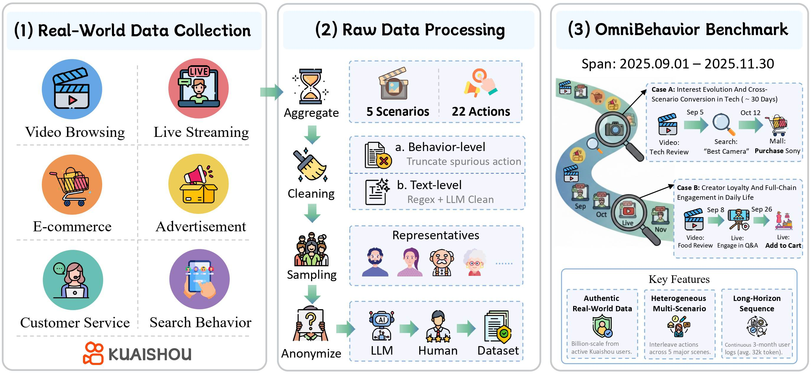
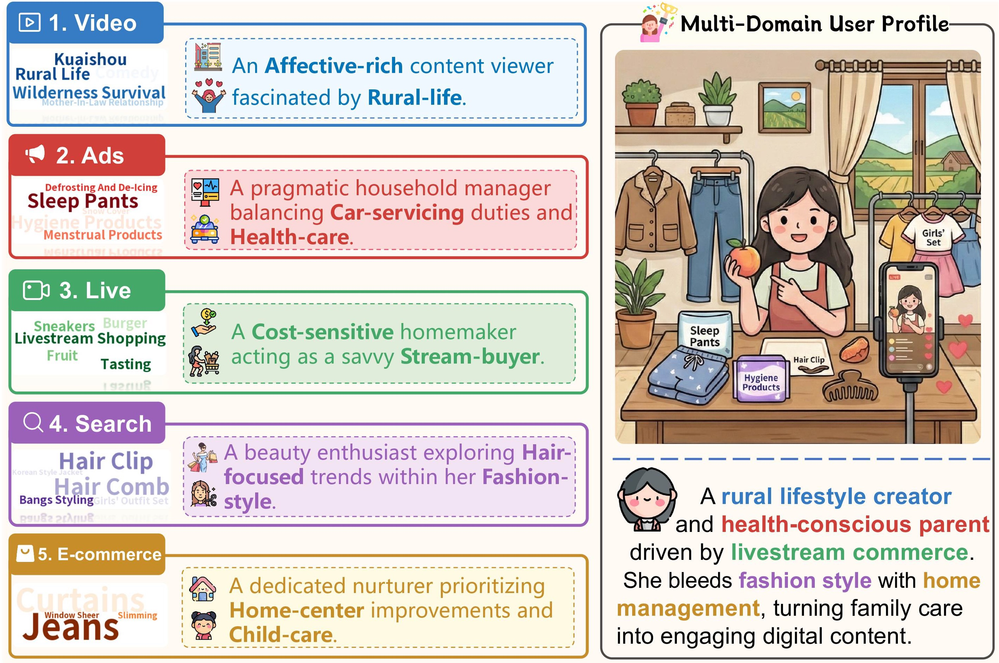

<a id="readme-top"></a>

<div align="center">
  <h2 align="center">OmniBehavior: Towards Real-world Human Behavior Simulation</h2>

  <p align="center">
    Benchmarking LLMs on Long-horizon, Cross-scenario, Heterogeneous Behavior Traces
  </p>
</div>


<p align="center">
  🌐 <a href="https://omnibehavior.github.io/" target="_blank">Website</a> &nbsp; | &nbsp;
  📃 <a href="https://arxiv.org/abs/2604.08362" target="_blank">Paper</a> &nbsp; | &nbsp;
  📚 <a href="https://huggingface.co/datasets/jiawei-ucas/OmniBehavior">Data</a> &nbsp; | &nbsp;
  🥳 <a href="#citation">Citation</a>
</p>


<p align="center">
  
</p>

## What's New

- **[2026.05.15]** We have released the complete dataset and evaluation code! Please check them out and feel free to use them in your research. ✨
- **[2026.04.10]** We have released the **OmniBehavior** paper! Please check it out for more details on our comprehensive user behavior analysis. 🔥🔥🔥

## Multiple Scenarios

**OmniBehavior** captures real user behaviors across several interactive scenarios in [Kuaishou](https://www.kuaishou.com/):


| Scene Type          | Description                                                                                                                                     |
| :------------------ | :---------------------------------------------------------------------------------------------------------------------------------------------- |
| **Live Streaming**  | Interactions within live stream rooms (e.g., watching duration, comments, likes, gifts).                                                        |
| **Video Browsing**  | Behaviors related to browsing and watching short videos.                                                                                        |
| **E-commerce**      | Shopping-related activities, including browsing products, managing carts, purchasing, and interactions with customer service agents. |
| **Advertisement**   | User interactions with recommended advertisements (views, clicks, conversions).                                                                 |
| **Search Behavior** | All in-app search activities, including but not limited to video and marketplace queries.                                                       |


### Dataset Highlights

The released dataset contains user behavior traces from [Kuaishou](https://www.kuaishou.com/):

- **Long-term Observation**: The data spans **90 days** (from `2025-09-01` to `2025-11-30`), providing a substantial timeline to observe evolving user interests and habitual patterns.
- **Real Interaction**: The dataset contains lots of **real actions**, capturing a consistent and detailed trail of user interactions.
- **Comprehensive Scenario Coverage**: The schema supports capturing behavior across **mainstream short-video platform scenarios**.

### Case Study Value

The long-horizon traces make the dataset useful for several research directions:
1.  **Long-term Interest Modeling**: The 3-month span allows for the specific tracking of interest shifts and stability over time.
2.  **Cross-Domain Behavior Analysis**: By covering diverse scenarios, it enables research into how behaviors in one domain (e.g., watching a streamer) correlate with actions in another (e.g., purchasing products or clicking ads).
3.  **User Behavior Simulation**: This detailed trajectory provides a ground truth for building user simulators, allowing to evaluate how well agents can simulate real, long-term human behavior patterns in complex environments.


<p align="center">
  
</p>

## Data Structure

The data is organized by user ID. Each user entry contains a textual profile and a chronological history of actions.


```json
{
  "user_ID": {
    "user_profile": "Description of the user (e.g., demographics, education, etc.)...",
    "action_history": [
      {
        "type": "Scenario Type",
        "timestamp": "YYYY-MM-DD HH:MM:SS",
        "context": {
          "field_name": "value",
          ...
        },
        "action": [
          {
            "type": "specific_behavior",
            "attribute": "value"
          }
          ...
        ]
      },
      ...
    ]
  }
}
```

<a id="installation-and-usage"></a>
## Installation and Usage

### Setup

```bash
pip install -r requirements.txt
```

Before running, download the user data provided with the paper and place the JSON files under:

```txt
./raw_user_data
```

Model keys and endpoints are not included. Edit the placeholder values in `src/config.py` before running evaluation.

### Model Deployment

For local model evaluation, we recommend serving models with [vLLM](https://github.com/vllm-project/vllm). See the vLLM repository for installation instructions.

Start an OpenAI-compatible vLLM server with:

```bash
vllm serve $MODEL_PATH \
  --port $PORT1 \
  --served-model-name $SERVED_MODEL_NAME \
  --enable-prefix-caching \
  --enable-chunked-prefill \
  -tp 8 \
  --gpu_memory_utilization=0.9 \
  --enable-prompt-tokens-details
```

Then add the endpoint to `MODELS_TO_EVALUATE` in `src/config.py`:

```python
{
    "name": "YourModel",           # Referenced by the MODEL variable in scripts/*.sh.
    "type": "openai_compatible",
    "api_key": "sk-dummy",
    "endpoints": [
        {"url": "http://HOST:PORT/v1", "max_workers": 20},
    ],
    "model": "SERVED_MODEL_NAME",  # Must match $SERVED_MODEL_NAME used by vLLM.
    "temperature": 0.1,
    "use_logprobs": False,
}
```

### Example Script

```bash
bash scripts/gpt5.sh
```

## License and Ethics

This code and dataset are released under the Creative Commons Attribution-NonCommercial-ShareAlike 4.0 International License (CC BY-NC-SA 4.0) for non-commercial use only. Any commercial use requires prior formal permission.

This dataset may include information derived from real users. While efforts have been made to anonymize sensitive data, privacy risks may remain. By accessing or using this dataset, you agree to use it only for lawful, ethical, and privacy-preserving purposes. You must not use it to identify, re-identify, contact, profile, track, or infer the identity of any individual.


Use of this dataset indicates your agreement to comply with all applicable privacy, data protection, and research ethics requirements.

Shield: [![CC BY-NC-SA 4.0][cc-by-nc-sa-shield]][cc-by-nc-sa]

This work is licensed under a
[Creative Commons Attribution-NonCommercial-ShareAlike 4.0 International License][cc-by-nc-sa].

[![CC BY-NC-SA 4.0][cc-by-nc-sa-image]][cc-by-nc-sa]

[cc-by-nc-sa]: http://creativecommons.org/licenses/by-nc-sa/4.0/
[cc-by-nc-sa-image]: https://licensebuttons.net/l/by-nc-sa/4.0/88x31.png
[cc-by-nc-sa-shield]: https://img.shields.io/badge/License-CC%20BY--NC--SA%204.0-lightgrey.svg

<a id="citation"></a>
## 📝 Citation

If you find our work useful in your research, please consider citing our paper.

```bibtex
@misc{chen2026omnibehavior,
      title={Towards Real-world Human Behavior Simulation: Benchmarking Large Language Models on Long-horizon, Cross-scenario, Heterogeneous Behavior Traces}, 
      author={Jiawei Chen and Ruoxi Xu and Boxi Cao and Ruotong Pan and Yunfei Zhang and Yifei Hu and Yong Du and Tingting Gao and Yaojie Lu and Yingfei Sun and Xianpei Han and Le Sun and Xiangyu Wu and Hongyu Lin},
      year={2026},
      eprint={2604.08362},
      archivePrefix={arXiv},
      primaryClass={cs.CL},
      url={https://arxiv.org/abs/2604.08362}, 
}
```
